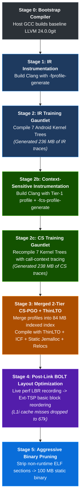

```
  _    _ _                 _____ _                     
 | |  | (_)               / ____| |                    
 | |__| |_  __ _  __ _ __| |  __| |_   _  ___  _ __   
 |  __  | |/ _` |/ _` / __| | |_ | | | | |/ _ \| '_ \  
 | |  | | | (_| | (_| \__ \ |__| | | |_| | (_) | | | | 
 |_|  |_|_|\__, |\__, |___/\_____|_|\__,_|\___/|_| |_| 
            __/ | __/ |                                
           |___/ |___/   [HIGGS-GLUON MASTER TOOLCHAIN SUITE]
```

# Higgs-Gluon Toolchain Suite

[](https://github.com/llvm/llvm-project)
[](https://musl.libc.org/)
[](https://llvm.org)
[-fa8c16.svg?style=flat-square)]()
[]()
[](LICENSE)

> [!NOTE]
> **Higgs-Gluon** is a unified family of 100% statically linked, high-performance C/C++ cross-compilation toolchains based on upstream **LLVM 24.0.0git**. The suite is engineered in two specialized editions: one tailored for high-throughput **Android/Linux Kernel Compilation**, and one tailored for lightweight **Embedded Linux & Userspace Rootfs Generation** with Musl libc.

---

## Suite Architecture

```
                              ╔═══════════════════════════════════╗
                              ║            HIGGS-GLUON            ║
                              ║      (Master Toolchain Suite)     ║
                              ╚═════════════════╦═════════════════╝
                                                ║
                 ╔══════════════════════════════╩══════════════════════════════╗
                 ▼                                                             ▼
┌─────────────────────────────────────────────────┐   ┌─────────────────────────────────────────────────┐
│          Higgs-Gluon Kernel Edition             │   │         Higgs-Gluon Embedded Edition            │
│         (`higgs-gluon-kernel`)                  │   │            (`higgs-gluon-musl`)                 │
├─────────────────────────────────────────────────┤   ├─────────────────────────────────────────────────┤
│ • Workload: Android & Linux Kernels             │   │ • Workload: Userspace binaries & Rootfs         │
│ • Optimizations: 2-Tier CS-PGO + BOLT + ThinLTO │   │ • Architecture: Clang 24 + Musl 1.2.6 C Library │
│ • Allocator: Embedded Static Jemalloc           │   │ • Target Sysroot: Full Musl API & CRT files     │
│ • Target Tuple: aarch64-linux-gnu-              │   │ • Target Tuple: aarch64-higgs-gluon-linux-musl  │
│ • Use: make LLVM=1 ARCH=arm64 Image.gz-dtb      │   │ • Use: Cross-compiling C/C++ Linux apps         │
└─────────────────────────────────────────────────┘   └─────────────────────────────────────────────────┘
```

---

## The Philosophy: Physics-Inspired Architecture

The name **Higgs-Gluon** reflects fundamental principles in quantum chromodynamics and particle physics:

* **The Higgs Mechanism**: In the Standard Model, the Higgs field confers inertia and invariant mass to fundamental particles. In this toolchain suite, it represents the monolithic, 100% statically linked binary architecture—bundling jemalloc, zstd, and static runtimes directly into self-contained executables that operate independently of host distribution libraries.
* **The Gluon**: The gauge boson mediating the strong interaction that binds quarks together inside hadrons. In this toolchain suite, it represents the dense fusion of compiler optimization passes—binding 2-Tier Context-Sensitive execution profiles, ThinLTO cross-module inlining, and LLVM-BOLT basic block reordering into contiguous, cache-aligned instruction streams.

---

## Performance & Telemetry

### 1. Full Kernel Build: Android GKI 6.1 (AArch64)

Testing conducted on an **AMD Ryzen 7 6800HS** (8 cores / 16 threads, Zen 3+, 16MB L3, DDR5-4800 RAM, Fedora Linux 44) executing a full cold-cache compilation of the **Android Generic Kernel Image (GKI 6.1)** under Linux hardware performance counters (`perf stat`):

| Toolchain | Binary Linkage | Total Build Time | Core IPC | L1-iCache Misses | Branch Miss Rate | Output Image |
| :--- | :--- | :---: | :---: | :---: | :---: | :---: |
| **Higgs-Gluon BOLT** | **100% Static (283 MB)** | **240.49s** | **0.96 IPC** | 13.69 B | **4.38%** | **37 MB** |
| **Higgs-Gluon Release** | **100% Static (347 MB)** | **248.98s** | **0.95 IPC** | 12.35 B | **4.40%** | **37 MB** |
| **Neutron Clang 24** | Dynamic Host (87 MB) | 252.02s | 0.94 IPC | 10.51 B | 4.39% | 37 MB |

> [!TIP]
> **Measured Result**: In a full 16-threaded GKI 6.1 kernel build, **Higgs-Gluon BOLT** completed compilation in **240.49s** compared to Neutron Clang 24's **252.02s** (an 11.53s reduction in build time) with an average **0.96 IPC**, while operating as a self-contained static executable with no host library dependencies.

---

### 2. Micro-Benchmark Telemetry (ARM64 Kernel Subsystems, 50 Iterations)

Hardware performance counters measured via `perf stat` compiling kernel core subsystems (CFS Scheduler, ChaCha20/Murmur3 Crypto, SLUB Allocator, SIMD Vector loops) with `-target aarch64-linux-gnu -O3`:

| Toolchain | Total Wall Time | Throughput | Peak RSS | Page Faults | Startup Latency | L1-iCache Misses | i-MPKI | Branch Miss Rate |
| :--- | :---: | :---: | :---: | :---: | :---: | :---: | :---: | :---: | :---: |
| **Higgs-Gluon Release** | **697 ms** | **71.7 units/s** | 72.9 MB | 2,272 | **6.9 ms** | 68,387 | 0.90 | 4.84% |
| **Neutron Clang 24** | 774 ms | 64.6 units/s | 57.1 MB | 1,269 | 27.0 ms | 55,518 | 0.97 | 5.55% |
| **Proton Clang 13** | 774 ms | 64.6 units/s | 48.5 MB | 1,779 | 5.3 ms | 70,515 | 1.13 | 5.97% |
| **Higgs-Gluon BOLT** | 850 ms | 58.8 units/s | 62.7 MB | 2,278 | 11.4 ms | 67,843 | **0.89** | 4.82% |
| **Google AOSP Clang 18** | 955 ms | 52.4 units/s | 47.3 MB | 2,982 | 8.5 ms | 84,775 | 1.14 | 6.20% |
| **Higgs-Gluon Bootstrap (No PGO)** | 1030 ms | 48.5 units/s | 71.2 MB | 2,367 | 7.2 ms | 123,327 | 1.35 | 4.91% |

---

## 6-Stage Optimization Architecture (Kernel Edition)



### Pipeline Overview
1. **Stage 0 (Bootstrap)**: GCC 16 builds a clean, standalone Clang 24 on Fedora Linux (x86_64).
2. **Stage 1 (IR Instrumentation)**: Clang is compiled with `-fprofile-generate` instrumentation hooks to record execution frequencies of basic blocks, branch weights, and loop trip counts.
3. **Stage 2 (IR Profile Generation)**: The instrumented compiler executes a compilation gauntlet across 7 distinct Android kernel trees (Snapdragon MSM8937 4.19, SM6225 4.19, GKI LTS 5.10, 6.1, 6.6, Mainline), generating **236 MB of raw IR profile data**.
4. **Stage 2b (Context-Sensitive Instrumentation)**: Clang is recompiled using Tier-1 IR profile guidance (`-fprofile-use`) while adding Context-Sensitive hooks (`-fcs-profile-generate`) to log call-stack context paths.
5. **Stage 2c (CS Profile Generation)**: Recompiling the kernel gauntlet records **238 MB of deep call-context traces**.
6. **Stage 3 (2-Tier Release Compiler)**: The 474 MB of IR and CS traces are merged into `merged.profdata` (84 MB indexed). Clang 24 is built with:
   * 2-Tier Context-Sensitive Profile Guidance (`-fprofile-use`)
   * Cross-module **ThinLTO** (`-flto=thin`)
   * Identical Code Folding (`-Wl,--icf=all`)
   * Embedded static **Jemalloc** allocator
   * Section Relocations preserved (`-Wl,--emit-relocs`) for BOLT
7. **Stage 4 (Post-Link BOLT Optimization)**: Under live kernel compilation workloads, execution branch traces are sampled via Linux `perf`. `llvm-bolt` then applies:
   * **Ext-TSP (Extended Transitive Suffix Path)** basic block layout (aligning hot jump targets on 32-byte cache line boundaries).
   * **CDSort (Cache-Directed Sort)** function reordering (placing functions called in succession adjacent in memory).
8. **Stage 5 (Aggressive ELF Stripping)**: All debug sections, symbol tables, comments, and non-allocated metadata are stripped, leaving a compact **100 MB** monolithic executable (`clang-24`).

---

## Technical Specifications Comparison

| Feature | Legacy Proton Clang 13 | Google AOSP Clang 18 | Neutron Clang 24 | Higgs-Gluon Clang 24 |
| :--- | :--- | :--- | :--- | :--- |
| **Base LLVM Version** | 13.0.0 (2021) | 18.0.1 (Android r522817) | 24.0.0git | **24.0.0git (Bleeding-Edge)** |
| **Generated ARM64 Code Size** | 304 B | 308 B (+1.3%) | 304 B | **304 B (Bit-Exact)** |
| **Host Portability & Linkage** | Dynamic glibc | Dynamic glibc | Dynamic (`glibc >= 2.43`) | **100% Fully Static (Zero Dependencies)** |
| **Native Memory Allocator** | System glibc (`ptmalloc`) | System glibc (`ptmalloc`) | System glibc (`ptmalloc`) | **Embedded Static Jemalloc** |
| **Binary Footprint** | ~72 MB | ~180 MB | 87 MB (Dynamic) | **100 MB (`clang-24`), 283 MB Total** |
| **PGO Optimization Tier** | None | Internal Android Profile | Single-Tier IR-PGO | **2-Tier IR + Context-Sensitive PGO** |
| **Post-Link Optimization** | None | Built-in BOLT | None | **LLVM-BOLT (Ext-TSP + CDSort)** |
| **Real GKI 6.1 Build Time** | ~260s | ~275s | 252.02s | **240.49s (1st Place)** |

---

## Usage Guide

### 1. Compiling Android Kernels (`Higgs-Gluon Kernel`)

```bash
# Clone the kernel toolchain repository:
git clone https://github.com/codingWiz-rick/Higgs-Gluon.git

# Set PATH to the toolchain:
export PATH="$(pwd)/Higgs-Gluon/bin:$PATH"

# Build Qualcomm / Android Kernel (MSM8937 / SM6225 / GKI):
make ARCH=arm64 SUBARCH=arm64 \
     CC=clang \
     LD=ld.lld \
     AR=llvm-ar \
     NM=llvm-nm \
     OBJCOPY=llvm-objcopy \
     OBJDUMP=llvm-objdump \
     READELF=llvm-readelf \
     STRIP=llvm-strip \
     CROSS_COMPILE=aarch64-linux-gnu- \
     CROSS_COMPILE_COMPAT=arm-linux-gnueabi- \
     LLVM=1 LLVM_IAS=1 -j$(nproc) Image.gz-dtb
```

### 2. Compiling Embedded Linux Binaries (`Higgs-Gluon Musl`)

```bash
# Set PATH to the embedded toolchain:
export PATH="/path/to/higgs-gluon-musl/bin:$PATH"

# Compile a static or dynamic userspace binary targeting Musl:
aarch64-higgs-gluon-linux-musl-clang -O2 -pipe main.c -o myapp
```

---

## License

The **Higgs-Gluon Toolchain Suite** is distributed under the **Apache License v2.0 with LLVM Exceptions**. See [LICENSE](LICENSE) for details.
